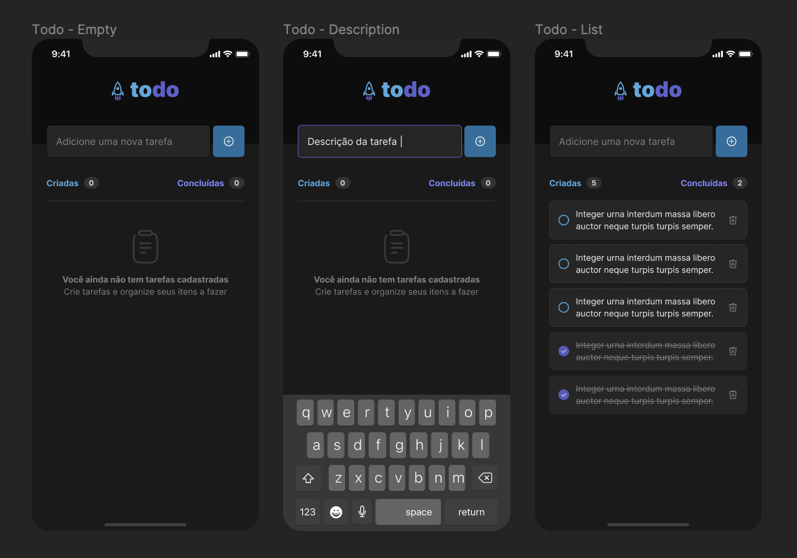

# todo-list-mobile

Aplicação de controle de tarefas no estilo to-do list realizado para fixar fundamentos do React Native.

Funcionalidades:

- [x] Adicionar uma nova tarefa
- [x] Marcar e desmarcar uma tarefa como concluída
- [x] Remover uma tarefa da listagem
- [x] Mostrar o progresso de conclusão das tarefas

Conceitos aplicados como:

- [x] Estados
- [x] Imutabilidade do estado
- [x] Listas e chaves no React Native
- [x] Propriedades
- [x] Componentização

